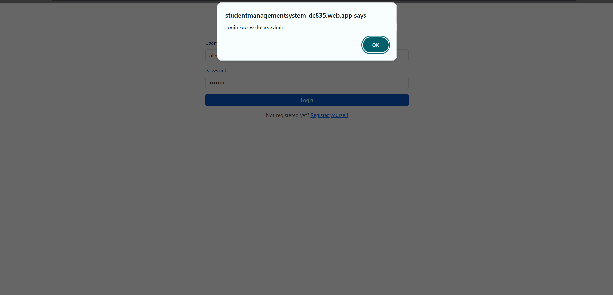
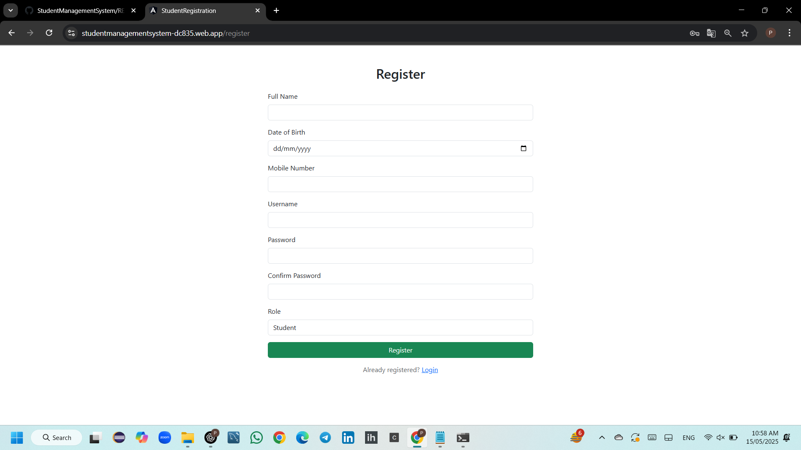
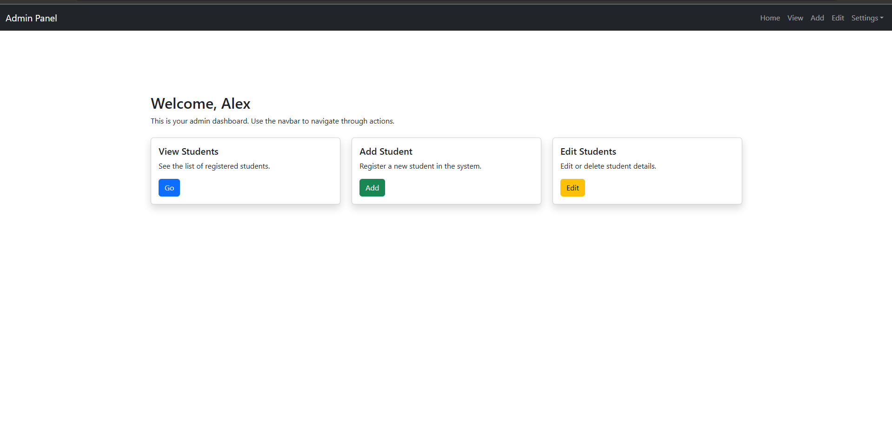
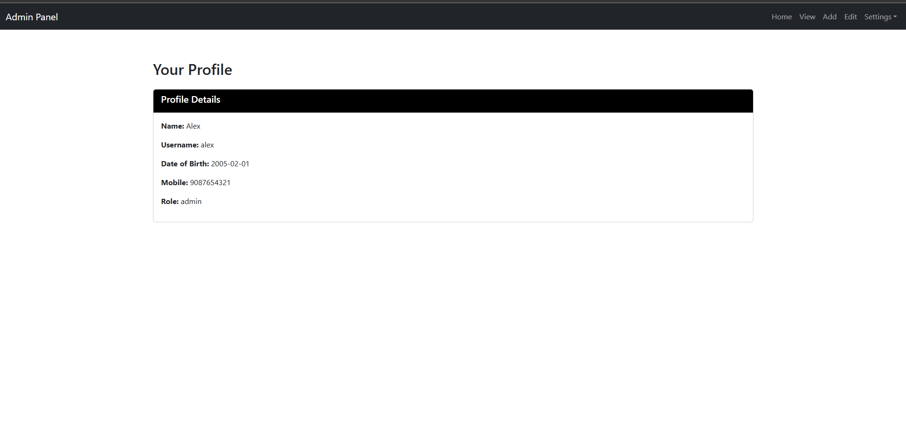
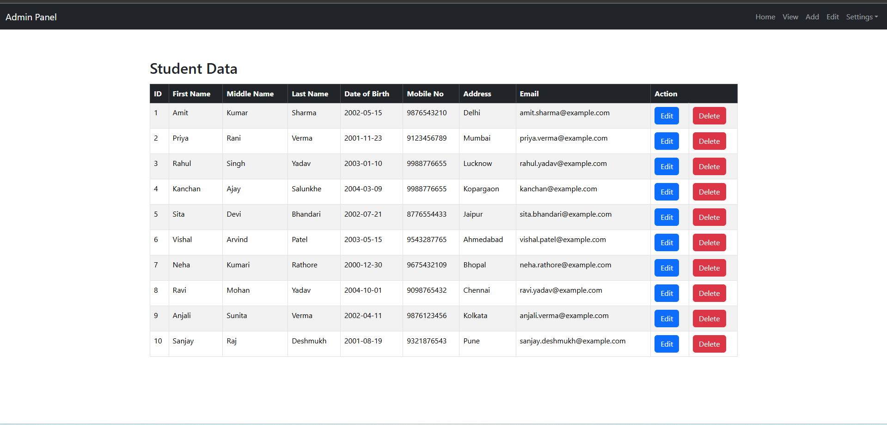
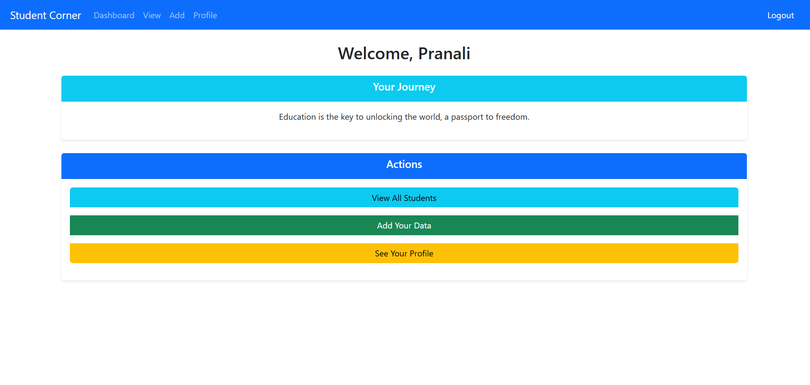

# 🎓 Student Management System - Angular Web App

This is a student data management system built using **Angular** and deployed using **Firebase Hosting**. The application provides separate modules for Admin and Student with basic login-based role access.

---

## ✨ Features

- 🔐 Login system for Admin and Students
- 🧑‍💼 **Admin Module**:
  - View all student data
  - Add, Edit, Delete (CRUD operations)
  - View own profile
- 🧑‍🎓 **Student Module**:
  - Add personal data
  - View all student records
  - View own profile
- 🔁 Role-based routing and restricted access
- 🗂️ JSON-server used to simulate a backend (`users.json`)

---

## 📸 Screenshots

  
  
  
  
  
  


---

## 🛠️ Tech Stack

- Angular
- TypeScript
- Bootstrap 5
- JSON Server

---

## 🔗 Live Demo

🚀 **Live Firebase Demo (Frontend only):**  
[https://studentmanagementsystem-dc835.web.app](https://studentmanagementsystem-dc835.web.app)

---

## ⚠️ Note

The Firebase-hosted version does **not include** a running backend (JSON-server), so login and data-related features may not work as expected.

👉 **To experience full functionality**, please clone the repository and run the project locally using JSON Server as described below.

---

## 🔧 Setup Instructions

```bash
# Clone the repo
git clone https://github.com/Panu2274/StudentManagementSystem.git

# Navigate to the project directory
cd StudentManagementSystem

# Install dependencies
npm install

# Run JSON server to simulate backend
json-server --watch db.json
json-server --watch users.json --port 3001

# Run the Angular app locally
ng serve
